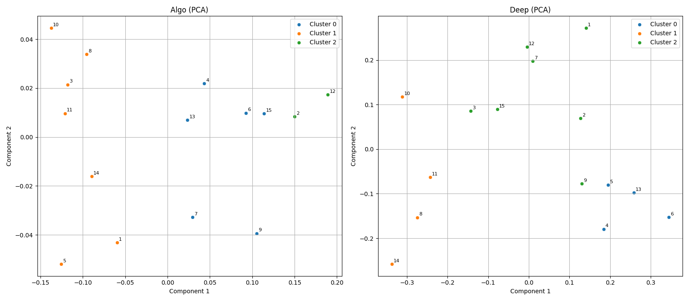

# Vibesort

Tool for clustering songs into playlists based on their audio characteristics and vibes. Vibesort offers two distinct approaches for analyzing and grouping music:

1. **Algorithmic Approach**: Uses classical signal processing features to construct song embedding:

    - Mel-Frequency Cepstral Coefficients (MFCCs): Captures the timbre of the track (13 coefficients, with both mean and standard deviation per coefficient).

    - Chroma STFT: Represents the harmonic and pitch class content.

    - Spectral Centroid: Indicates the center of mass of the spectrum, often perceived as the brightness of a sound.

    - Spectral Bandwidth: Measures the spread of the spectrum.

    - Spectral Rolloff: Frequency below which a specified percentage of the total spectral energy lies.

    - Zero Crossing Rate: The rate at which the audio signal changes sign, useful for detecting percussive or noisy sounds.

    - RMS Energy: Root-mean-square energy representing the loudness of the track.

    - Tempo: Estimated beats per minute (BPM), capturing the rhythmic feel of the audio.

    Each feature is summarized (usually by mean or standard deviation) to form a compact, fixed-size numerical representation of the song, suitable for machine learning or clustering algorithms.

2. **Deep Learning Approach**: Leverages the MERT (Music Embedding through Representation Transformers) model to extract high-level musical features and semantic understanding of the audio content. This approach can capture more complex musical patterns and relationships that might be difficult to express through traditional audio features. 🔗 [Read the MERT paper (arXiv:2306.00107)](https://arxiv.org/pdf/2306.00107)

Both approaches use K-means clustering on their respective embeddings to group similar songs together, creating cohesive playlists that match different moods or styles.

## Installation

### Virtual Environment (Recommended)

It's best practice to use a virtual environment to keep your project dependencies isolated:

```bash
# Create a virtual environment
python -m venv .venv

# Activate it
source .venv/bin/activate  # On Windows: .venv\Scripts\activate

# [Optional] install pytorch according to instructions
# https://pytorch.org/get-started/
```

Once activated, you can proceed with either inference-only or development setup.

### Inference only

If you only need the package for inference, install it directly from GitHub:

```bash
pip install git+https://github.com/GalychMaks/vibesort.git
```

### Development

If you want to contribute or make changes to the code:

```bash
# Clone the repository
git clone https://github.com/GalychMaks/vibesort.git
cd vibesort

# Install the package with development dependencies
pip install -e .[dev]

# Set up pre-commit hooks
pre-commit install
```

## Usage

### Command Line Interface (CLI)

After installation, you can use Vibesort directly from the command line:

```bash
vibesort -p /path/to/audio/folder -n 3 --method deep
```

Arguments:

- `-p, --path`: Path to folder containing audio files (default: "data/audio/")
- `-n, --num_clusters`: Number of playlists to generate (default: 3)
- `-o, --output`: Output file name for the generated playlists (optional, if not provided playlists will only be returned)
- `--method`: Clustering method to use: 'deep' (default) or 'algo'
- `--model`: MERT model to use with the deep method (default: "MERT-v1-95M")

### Python API

You can also use Vibesort programmatically in your Python code:

```python
from vibesort import DeepVibeSorter, AlgoVibeSorter

# Using deep learning-based clustering (recommended)
sorter = DeepVibeSorter(mert_model_name="MERT-v1-95M")
playlists = sorter.run(
    folder_path="path/to/audio/folder",
    num_clusters=3
)

# Or using classical audio feature-based clustering
sorter = AlgoVibeSorter()
playlists = sorter.run(
    folder_path="path/to/audio/folder",
    num_clusters=3
)
```

The output will be a Python dictionary containing the generated playlists, where each song is grouped into a cluster based on its audio characteristics. If an output file is provided, the playlists will also be saved to that file as JSON.

## Analysis

Analysis of audio embeddings for It-Jim Trainee program 2025 Dataset Task 3 - Audio

### PCA Comparison

  

### t-SNE Comparison

  

### Insights

In the Algo (PCA) approach, we can see that clusters are separated by horizontal lines, which indicates that the clustering algorithm relies mainly on the first principal component. A more detailed analysis shows that the first and second PCA components in the Algo approach explain 88.85% and 6.1% of the variance, respectively. This suggests that the Algo features are highly correlated.

In contrast, the deep learning embeddings distribute the variance more evenly, with the first and second PCA components explaining 27.16% and 14.8% of the variance, respectively.

The plots also show that the Algo features form two main clusters, whereas the deep learning approach results in a more dispersed distribution in the feature space. However, this could be a consequence of projecting high-dimensional data (768D) into only two dimensions.

**The overall conclusion** is that deep learning embeddings better represent audio characteristics. However, the Algo approach, using a simple set of features, was able to form nearly the same clusters (9 out of 15 matches) while requiring significantly fewer computational resources.

## References

This project is built upon several powerful open-source technologies:

### Deep Learning

- [MERT (Music Embedding through Representation Transformers)](https://huggingface.co/m-a-p/MERT-v1-95M) - Pre-trained music understanding model used for extracting deep audio features
- [🤗 Transformers](https://github.com/huggingface/transformers) - Framework for using state-of-the-art transformer models

### Audio Processing

- [librosa](https://librosa.org/) - Python package for music and audio analysis, used for classical feature extraction
- [soundfile](https://github.com/bastibe/python-soundfile) - Library for reading and writing audio files
- [torchaudio](https://pytorch.org/audio) - Audio processing tools from the PyTorch ecosystem

### Machine Learning

- [scikit-learn](https://scikit-learn.org/) - Used for K-means clustering of audio features
- [PyTorch](https://pytorch.org/) - Deep learning framework used with MERT models

### Development Tools

- [Ruff](https://github.com/astral-sh/ruff) - Fast Python linter and formatter
